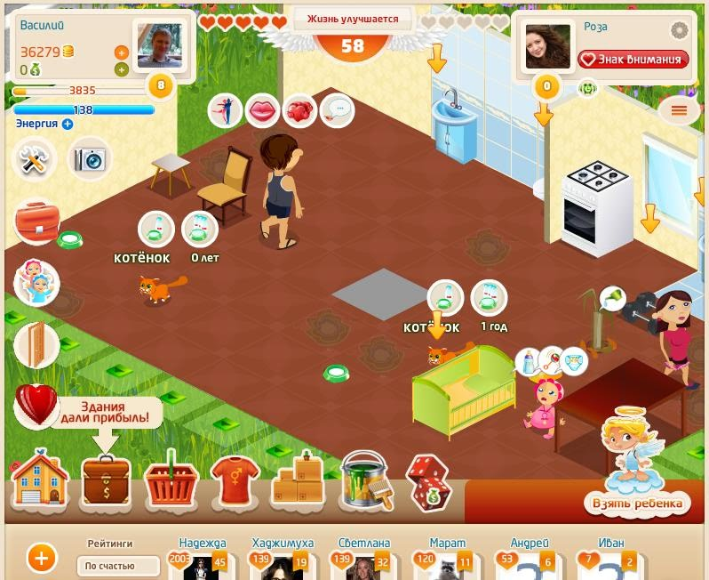

## онлайн ММО игра Любимая Семья(аналог Social Sims)

1 800 000 пользователей, 80 000 Daily Active Users;
без единого баг репорта(только клиент игры) от пользователей за все время моей работы(около года) на компанию "Бюро Пирогова", я был единственным разработчиком кода клиента игры в комманде разработки проекта(0 тестеров в команде), игра сделана "с нуля" за 4-5 месяцев (далее она усложнялась)

# Содержание:
1. обзор проекта
2. описание кода/архитектуры, навигация по коду

## 1 обзор проекта

в MMO игре "Любимая Семья" пользователь может обустроить собственную виртуальную квартиру, вести семейную жизнь с другим пользователем: завести детей, домашних животных, вести свой бизнес, использовать интерактивные предметы (приготовить еду на плите, поиграть на гитаре, обнять другого игрока итд).

официальная презентация:  
https://disk.yandex.ru/i/RGa2SK8i87pf5Q

видеообзор функционала игры:  
https://rutube.ru/video/ffeac2be9ba3235485f21c11ee328e85/

обзоры игры в СМИ:
- https://web.archive.org/web/20210416144915/https://vkontaktehit.ru/igra-lubimaya-semiya-v-kontakte.html
- https://web.archive.org/web/20181108070658/http://socvopros.ru/blog/V_Kontakte_-_Igry/1711.html

### Функционал:

- обустройство собственной виртуальной квартиры мебелью, декором, функциональными предметами. при покупке специальных предметов интерьера возможно использование их персонажами (просмотр TV, игра на гитаре, тренажер. купив плиту можно готовить блюда и есть их. кроватку, горшок - для ребенка итд)
- смена стиля персонажа (смена внешности, прически и одежды)
- покупка домашних животных и предметов для них (после чего нужно их кормить итд)
- свадьба, развод (квартиры и их содержимое объединяются при свадьбе в одну большую)
- завести детей (возможно после покупки необходимых вещей - на каждого ребенка по кроватке, горшку)
- ведение бизнеса: покупка зданий, назначение директоров
- поход в гости к друзьям

### Задачи:

- разработка клиента с нуля: вид и поведение персонажей, их взаимодействие с игровым миром, движок отображения анимаций аватаров, диметрический движок (отображение игрового мира, перемещение персонажей)
- постановка задач штатным сотрудникам: составление инструкций по разработке контента (скины персонажей, объекты игрового мира) для художников, аниматоров. принятие работы
- постановка задач по контенту и интерфейсам аутсорсерам (написание ТЗ) , принятие работы
- участие в разработке и оптимизации протокола серверной части, в частности снижение объема трафика и частоты запросов

### Инициативность:

- предложение на рассмотрение новых игровых возможностей, не присутствующих в оригинальном законченном диздоке. в частности была предложена и успешно введена возможность взаимодействия персонажей друг с другом и с предметами в квартире
- также разработан и улучшен дизайн интерфейсов

### факты:
аудитория разраслась очень быстро, вирусно, (за пару месяцев после запуска набралось несколько сотен тысяч) - на тот момент это был первый проект в РФ подобного масштаба и вида). первая готовая версия игры была запущена спустя 4-6 месяцев после начала разработки проекта

## описание кода/архитектуры, навигация по коду

языки программирования: ActionScript 3.0

фреймворки: архитектура:
1. PureMVC
2. собственные фреймворки:

2.1 мультиагентная архитектура (мультиагентные системы)  
2.2 движки отображения игрового мира:  
2.2.1 https://github.com/softwareDeveloper2014/application-component-Simple-Isometric-Game-Engine  
2.2.2 https://github.com/softwareDeveloper2014/application-component-Simple-Isometric-Engine  
2.3 движок стиля и поведения персонажей  

